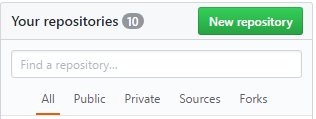
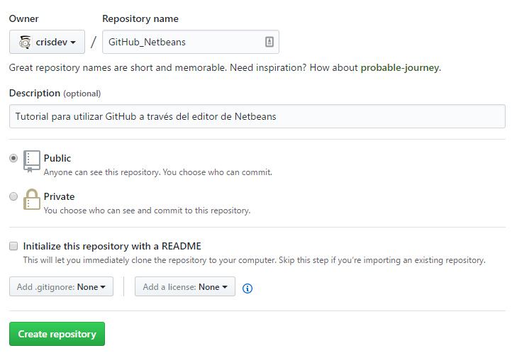
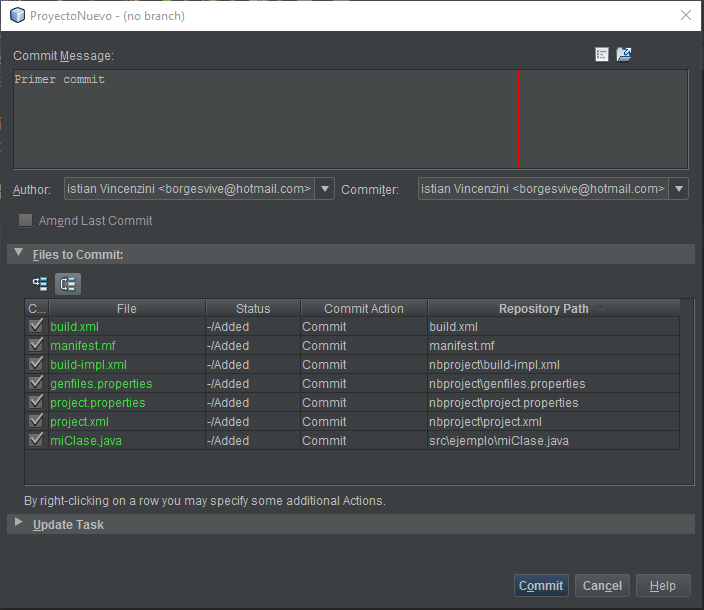
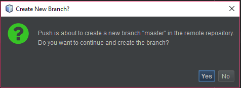

# Tutorial GitHub con Netbeans

## Primera parte

Los pasos a seguir en esta primera parte se realizarán en GitHub.
Se supone que el usuario ya tiene una cuenta en la página y que
además se encuentra en ella.

El primer paso será crear un nuevo repositorio.

Daremos un nombre y una descripción a nuestro repositorio.
GitHub no permite crear repositorios privados, así que
dejaremos la opción pública que viene por defecto.

Por el momento, tampoco asignaremos una licencia, un README
ni un fichero de exclusión (gitignore).

Una vez finalizado el paso anterior, GitHub nos presentará
un informe, del cual rescataremos uno de los datos guardándolo
en el portapapeles.

## Segunda parte

Para esta parte, iniciaremos Netbeans y seleccionaremos
la opción _Team/Git/Clone_ de la barra del menú.

En el URL pegaremos la información que obtuvimos de la primera
parte. Luego completaremos los campos de usuario y contraseña
con nuestros datos de Git, y le daremos a _Next_.

En el siguiente paso Netbeans nos pide seleccionar la rama
que queremos copiar del repositorio creado en GitHub;
esto es así ya que podemos crear varias ramas de trabajo.
Como aún no tenemos ninguna, le daremos a _Next_.

Finalmente, podremos elegir la carpeta de destino donde
se clonará el proyecto. Dejaremos la que está por defecto y
terminaremos con _Finish_.

Netbeans nos preguntará si deseamos crear un proyecto
a partir de las fuentes clonadas, aceptaremos con
_Create Project_ y crearemos nuestro proyecto inicial.

En este punto ya tendremos nuestro repositorio local creado.
Visiblemente, deberíamos observar una lata azul al lado del
nombre de nuestro proyecto. Esto indica que git reconoce que
hay ficheros nuevos en nuestro repositorio local, y aparecerá
cada vez que hagamos cambios en nuestro trabajo; deberemos
indicarle a git que le saque una foto a nuestro trabajo y la
guarde en el repositorio.

Para hacerlo, seleccionaremos nuestro proyecto
y luego iremos a _Team/Commit_.

En esta ventana podremos seleccionar los ficheros que queremos
almacenar en el repositorio. Sólo aparecerán aquellos que fueron
modificados o que han sido recién creados. Deberemos introducir
un nombre que identifique a la "foto" que estamos tomando, es
decir que describa los cambios que hemos hecho.

Finalmente, haremos clic en _Commit_ y la lata azul desaparecerá,
indicando que los cambios fueron almacenados.

### Enviar los datos a GitHub

De tener clases en un proyecto existente, podemos copiarlas
o moverlas en el nuevo proyecto. Cada vez que hagamos esto,
o realicemos cambios, la lata azul se hará visible, y deberemos
volver a sacar la foto a nuestro proyecto, de forma de almacenarlo
para luego ser enviado.

Para enviar nuestro proyecto a GitHub, debemos ir a la barra
de menú en la opción _Team/Git/Push to upstream_. Se nos preguntará
si deseamos crear una rama nueva en el repositorio remoto, aceptaremos.

La siguiente ventana nos preguntará si deseamos que la rama
seleccionada sea la principal. Aceptaremos ya que será la única
que seguiremos en el repositorio remoto.

¡Listo! Si volvemos a GitHub y refrescamos la página
ya podremos ver nuestro proyecto disponible.

A partir de este momento ya todo el proceso será más sencillo.
Cada vez que agreguemos algo a nuestro proyecto deberemos primero
hacerle un _Commit_, como ya hemos visto, y con esto lo almacenaremos
en nuestro disco. Luego, deberemos "empujarlo" a GitHub; para esto
simplemente vamos a _Team/Remote/Push_ seleccionamos el repositorio
avanzamos en las ventanas con _Next_ y tendremos nuestro
proyecto guardado en GitHub.

### Clonar proyecto / Actualizar datos

Si trabajamos en un equipo ajeno y queremos recuperar nuestros
datos, lo que deberemos hacer primero será clonarlo. Para
esto iremos a _Team/Git/Clone_ y completando nuestros datos
ya tendremos nuestro trabajo disponible para realizar cambios
y empujarlos al repositorio.

No hace falta volver a clonar el proyecto cada vez. Cuando
éste ya fue clonado y queremos recuperar los cambios realizados,
la opción que necesitamos es _Team/Remote/Pull from Upstream_.
Primero debemos situarnos en el proyecto que queremos actualizar
y luego seleccionaremos dicha opción.
